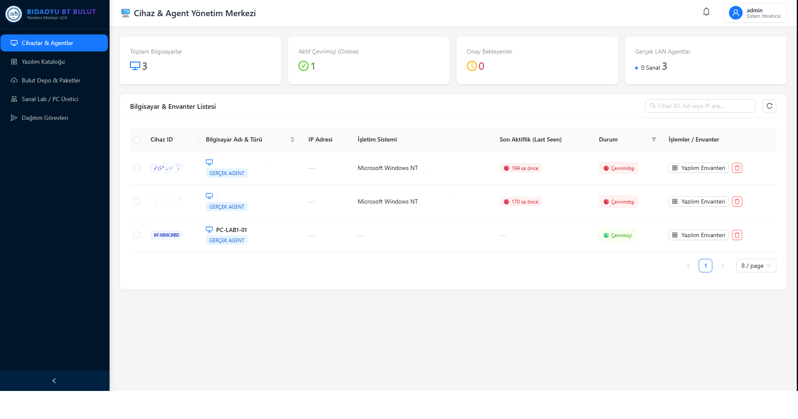

# 🏛️ BİDADYU - Adıyaman Üniversitesi BT Yönetim & Destek Platformu


**BİDADYU**, Adıyaman Üniversitesi Bilgi İşlem Daire Başkanlığı (BİDB) bünyesindeki bilgisayar envanterini, yazılım dağıtımlarını, sanal laboratuvar sistemlerini ve kullanıcı destek taleplerini merkezi olarak yönetmek için geliştirilmiş kurumsal bir BT Yönetim Platformudur.

---

## 🌟 Öne Çıkan Özellikler

- 💻 **Merkezi Bilgisayar Envanteri:** Tüm istemci bilgisayarların anlık CPU, RAM, disk kullanımı, canlı görünürlük durumları ve yazılım envanteri takibi.
- 🚀 **Uzaktan Yazılım Dağıtımı (Deployment Jobs):** `.msi` ve `.exe` formatındaki paketlerin hedef bilgisayarlara veya gruplara uzaktan sessiz kurulumu (Silent Install) ve canlı ilerleme takibi.
- 🔔 **Masaüstü Agent & Sistem Tepsisi (Tray App):** 
  - İstemci bilgisayarlar için özel geliştirilmiş C# .NET 8 Windows Forms tabanlı masaüstü ajanı.
  - Sistem tepsisinde (Taskbar Tray) BİDB logosuyla 7/24 kesintisiz çalışma.
  - Kullanıcıların tek tıkla arıza kaydı veya eksik program talebi oluşturabilmesi.
  - Yönetici yanıt verdiğinde anında masaüstü bildirimi ve canlı durum takibi ("Şu An İlgileniliyor", "Tamamlandı").
- 🗄️ **Bulut Depolama & Paket Kütüphanesi:** Dağıtılacak yazılım paketlerinin yüklendiği ve yönetildiği merkezi veri deposu.
- 🎓 **Sanal Laboratuvar Yönetimi:** Bilgisayar laboratuvarlarının ve imajların merkezi kontrolü.
- 🐳 **Docker & Container Uyumluluğu:** Tek komutla tüm platformu ayağa kaldırabilme.

---

## 🛠️ Teknoloji Yığını

### **Backend (Sunucu API)**
- **Framework:** .NET 8 Web API
- **Veritabanı:** SQLite / EF Core 8 (Entity Framework)
- **Kimlik Doğrulama:** JWT (JSON Web Token) & Dynamic Role Security
- **Loglama:** Serilog (Console & File logging)

### **Frontend (Yönetim Web Paneli)**
- **Framework:** React 19 + TypeScript + Vite 8
- **UI Kütüphanesi:** Ant Design 6 + Tailwind CSS
- **State Yönetimi & HTTP:** Zustand & Axios & React Query

### **Agent (İstemci Uygulaması)**
- **Framework:** .NET 8 Windows Forms (System Tray App)
- **Paketleme:** Self-Contained Single Executable (`BIDADYUAgent.exe`)
- **İletişim:** HTTP REST API & Heartbeat Polling Mechanism

---

## 🚀 Hızlı Başlangıç

### **Seçenek A: Docker ile Çalıştırma (Önerilen)**

Bütün bağımlılıkları tek bir komutla başlatmak için:

```bash
docker-compose up --build
```
- **Web Yönetim Paneli:** `http://localhost:5173`
- **Backend API & Swagger:** `http://localhost:5000/swagger`

---

### **Seçenek B: Yerel Geliştirme Ortamı (Local Dev)**

Kök dizindeki **`BASLAT_TUM_SERVISLER.bat`** betiğini çalıştırarak tüm servisleri başlatabilirsiniz.

Veya manuel olarak:

1. **Backend Başlatma:**
   ```bash
   cd src/backend/BIDADYUManagement.Api
   dotnet run --launch-profile http
   ```

2. **Frontend Başlatma:**
   ```bash
   cd src/frontend
   npm install
   npm run dev
   ```

3. **Agent Başlatma:**
   ```bash
   c:\Users\Kaplan\Desktop\BIDADYU-Agent-SingleExe\BIDADYUAgent.exe
   ```

---

## 🖥️ Agent Yapılandırması (`server_ip.txt`)

İstemci bilgisayarlara dağıtılan `BIDADYUAgent.exe` dosyasının yanında bulunan `server_ip.txt` dosyası sunucu IP adresini belirler:

```text
x.x.x.x
```

Sunucu IP adresi değiştiğinde sadece bu metin belgesini güncellemek yeterlidir.

---

## 📸 Ekran Görüntüleri & Görseller

| BİDB Arayüzü | Sistem Tepsisi Ajanı |
| :---: | :---: |
|  |  |

---

## 📝 Lisans ve Telif Hakkı

© 2026 **Adıyaman Üniversitesi Bilgi İşlem Daire Başkanlığı (BİDB)**. Tüm hakları saklıdır.
